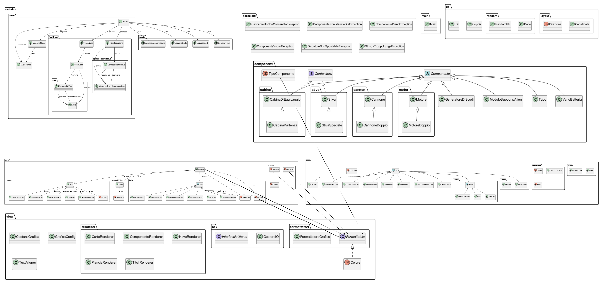

# Galaxy Trucker - Gruppo 38

**Galaxy Trucker** è un gioco da tavolo in cui i giocatori costruiscono astronavi al fine di trasportare e vendere merci nell'universo, affrontando imprevisti e pericoli.  
Questo repository contiene una versione digitale del gioco, realizzata come progetto per il corso di Programmazione ad Oggetti presso l’[Università degli Studi di Bergamo](https://www.unibg.it/).

---

## Autori – Gruppo 38
- Matteo Baccanelli (MatteoBaccanelli)
- Michele Bisignano (michele-bisignano)
- Marco Magri (Igramoz)
- Henry Iannella Jones (HenryIannella) 
- Michele Messina (8TB-Available)

---

## Obiettivo del progetto

L’obiettivo principale è stato quello di applicare il paradigma della programmazione ad oggetti per modellizzare il gioco “Galaxy Trucker”.  
Particolare attenzione è stata rivolta all'organizzazione delle classi e alla gestione delle relazioni tra oggetti.

---

## Come eseguire il progetto

Di seguito sono riportate le istruzioni per eseguire il progetto in diversi ambienti.

### Da IDE

1. Clona il repository  
   ```sh
   git clone https://github.com/Igramoz/Galaxy-Trucker.git
   ```

2. Importa il progetto in un IDE compatibile con Java.

3. Esegui la classe `main.Main` per giocare.

4. Regolare lo zoom per nascondere la linea verticale a destra, oppure modificare il valore della costante `LARGHEZZA_SCHERMO` nella classe `GraficaConfig`, appartenente al package `grafica`.

### Da Windows

1. Clona la repository 
2. Apri la cartella del progetto
3. Entra nella cartella scripts 
4. Esegui il file ```esegui.bat```

### Da MacOS e Linux

1. Clona la repository 
2. Apri il terminale e naviga nella cartella del progetto
3. Entra nella cartella scripts tramite il comando ```cd scripts/```
4. Esegui ```chmod +x esegui.sh``` (per rendere eseguibile lo script)
5. Esegui lo script con ```./esegui.sh```

---

## Struttura del progetto

Per visionare la struttura del progetto guardare la cartella `docs` dove sono presenti:

- [Tree](./docs/tree.md): per visualizzare la struttura ad albero del progetto.
- [UML](./docs/UML-completo.png): per visualizzare il diagramma UML completo.



---

## Cranio Creations

Per maggiori informazioni sul gioco originale, consultare la pagina ufficiale:  
[https://www.craniocreations.it/prodotto/galaxy-trucker](https://www.craniocreations.it/prodotto/galaxy-trucker)

--

## Note finali

Progetto sviluppato per l’esame di Programmazione ad Oggetti presso l'[Università degli Studi di Bergamo](https://www.unibg.it/)  
Gruppo 38
